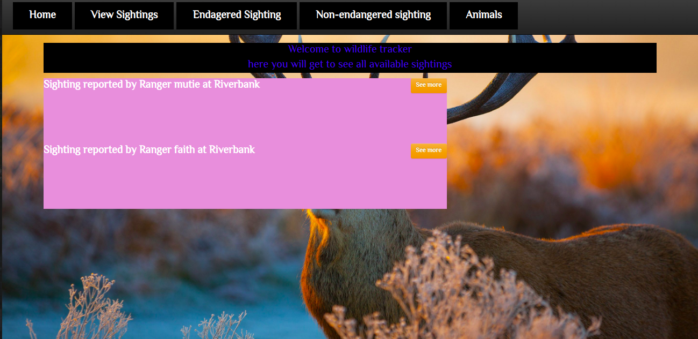
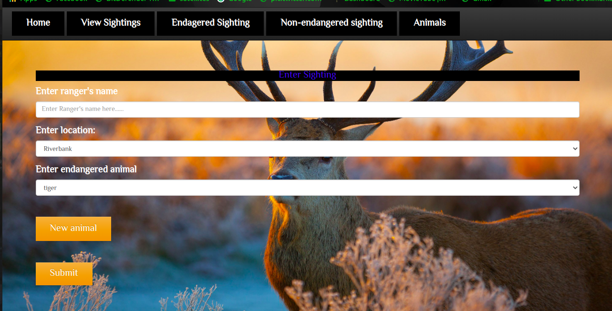
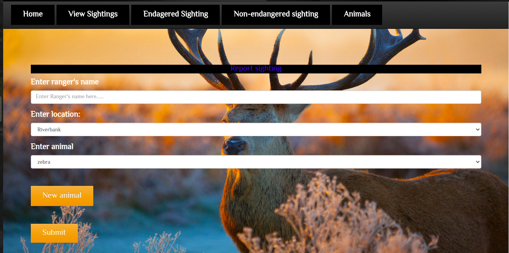

 # Wildlife Tracker
A java spark app for the Forest Service to conduct an environmental impact study.

## Livelink

 https://gwildlife.herokuapp.com/
 

## Author
Gloria Mutie

## Technologies and frameworks used
    1. java 11
    2. spark core 2.12
    3. Gradle 4.10
    4. Spark Template Velocity
    5. Junit 5
    6. Postgres database

## Database

In PSQL:

    CREATE TABLE animals(id SERIAL PRIMARY KEY,health varchar, age varchar, type varchar,name varchar);
    CREATE TABLE locations(id SERIAL PRIMARY KEY, name varchar);
    CREATE TABLE rangers(id SERIAL PRIMARY KEY, firstname varchar, lastname varchar , badgenumber int);
    CREATE TABLE sightings(id SERIAL PRIMARY KEY, ranger varchar , location varchar, animalid int);
    
## Testing

   ```java```
    gradle test

## Screenshots








