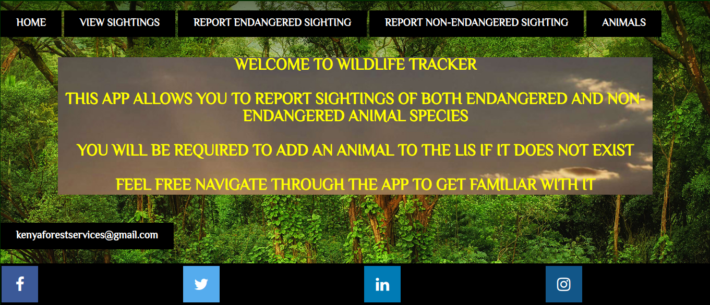
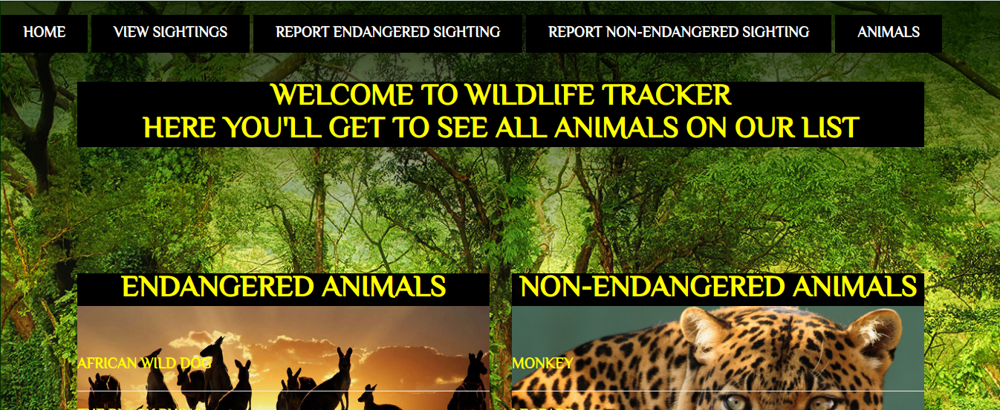
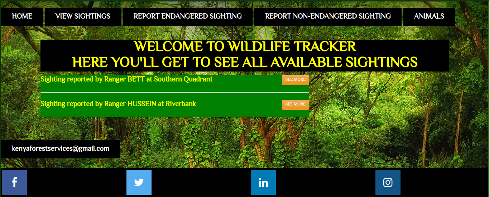

# <span style="background-color: #FFFF00">WILDLIFE TRACKER</span>

## <span style="background-color: #FFFF00">An application that allows Rangers to track wildlife sightings in the area.</span>


[https://chepkirui-tracker.herokuapp.com/](https://chepkirui-tracker.herokuapp.com/)

## SCREENSHOT DEMO

## <span style="background-color: #FFFF00">HOMEPAGE</span>



## <span style="background-color: #FFFF00">VIEW ANIMALS</span>

 

## <span style="background-color: #FFFF00">VIEW SIGHTINGS</span>
 
  

## AUTHOR
```bash
MAUREEN CHEPKIRUI
```
## PRODUCTION DATE
````bash
20TH JULY 2020
````
## LINK TO OTHER PROJECTS

[GitSearch](https://github.com/Maureenchepkirui/GitSearch) GitSearch-A website where users may enter a GitHub username into a form, submit it, and see names and descriptions of that person's public repositories. A person can also look for repositories

[QuotesApp](https://github.com/Maureenchepkirui/Quotes)   -An application where users can create quotes and have those quotes voted on whether they are terrible or are inspirational.

[PizzaApp](https://github.com/Maureenchepkirui/IP4PIZZA) -A Web application that allows customers to select the type of pizza the need and also request delivery if need be.

## TECHNOLOGIES

   

## GETTING STARTED
```
git clone https://github.com/Maureenchepkirui/WildlifeTracker.git
cd wildlife-tracker
open in intellij or your preferred IDE and gradle run
```
## SQL
````
Ensure you have posgresql installed
Run the following commands to create your database:
CREATE DATABASE wildlife_tracker;
\c wildlife_tracker;
CREATE TABLE animals(id serial PRIMARY KEY, name VARCHAR, type VARCHAR, health VARCHAR, age VARCHAR);
CREATE TABLE sightings (id serial PRIMARY KEY, location VARCHAR, rangerName VARCHAR, animalId INTEGER, createdAt TIMESTAMP);
CREATE DATABASE wildlife_tracker_test WITH TEMPLATE wildlife_tracker;
````
## DROPPING DATABASE
````
Run the following commands to drop a database
DROP DATABASE wildlife_tracker;
DROP DATABASE wildlife_tracker_test;
````
## USER REQUIREMENTS
````
The applications allow users to do the following:
1.Add a new animal
2.Add an endangered animal
3.Add an animal Sighting
````
## CONTACT DETAILS
````
For clarification reach out to me on maureenchepkirui005@gmail.com
````

## LICENCE

This project is licensed under the MIT Open Source license Copyright (c) 2020. LICENCE

